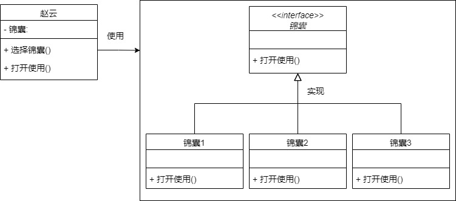
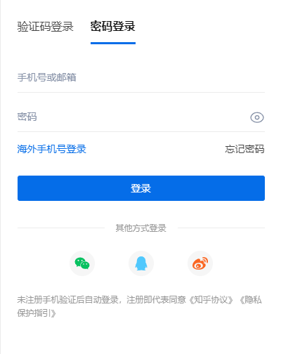
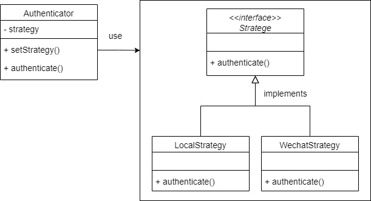

# 设计模式之策略模式

在进行软件开发时要想实现可维护、可扩展，就需要尽量复用代码，并且降低代码的耦合度，而设计模式就是一种可以提高代码可复用性、可维护性、可扩展性以及可读性的解决方案，本文将介绍设计模式中的**策略模式**。


### 基本概念

策略模式（Strategy Pattern）是一种被应用广泛的**行为型模式**，策略模式最大的特点就是将不同的算法进行封装，并且实现统一的接口交由调用者调用。策略模式的重心不是算法实现，而是如何组织和调用这些算法。


### 角色

为了方便理解，下面以一个故事举例：

周瑜为了夺回荆州，设计让刘备到江东联姻，准备将刘备软禁。而诸葛亮事先给了赵云三个锦囊，内藏三条妙计，并且吩咐：“到江东时打开第一一个，到年底时打开第二个，危急关头打开第三个。” 三个锦囊最终帮助刘备全身而退。


从上面故事可以分析出两个关键点：

**锦囊妙计**：封装了帮刘备度过难关的**妙计**，需要时只要**打开使用**，放置于**锦囊**之中，并不需要关心内容，只需要照着执行

**赵云**：按照具体的步骤和时机**打开使用**对应的**锦囊**

这中间各自完成特定的任务，并且相互存在联系，重要的是锦囊的组织方式和使用时机。

对应到策略模式的角色结构来看，包含三种角色，分别是：抽象策略接口（锦囊）、具体策略实现（封装好的锦囊妙计）、环境上下文（赵云）。

| 角色                       | 关系                 | 作用                                                         |
| -------------------------- | -------------------- | ------------------------------------------------------------ |
| 抽象策略 Strategy          | 具体策略类接口定义   | 定义抽象方法（打开锦囊）                                     |
| 具体策略 Concrete Strategy | 抽象策略的接口实现类 | 实现接口的方法，描述具体的算法实现（妙计执行方式）           |
| 上下文环境 Context         | 持有具体策略实例引用 | 调用具体策略所实现的抽象策略接口中的方法（赵云揣着锦囊，关键时刻打开） |

下面来看UML图




### 场景举例

常见的网站都支持用户使用不同的登录方式登录账号，比如：账号密码登录、手机验证码登录和其他登录方式。



现在来当一次诸葛亮，假设不使用策略模式，要怎么实现各种登录方式，要如何用策略模式为这些登录场景设计登录策略？


经过前面的介绍，这里将策略模式的使用步骤分为以下三步：

1. 定义抽象策略接口，并且定义通用的公共方法；
2. 实现策略接口，封装具体的算法；
3. 创建环境上下文，也就是具体的使用者类，引用策略接口的具体实现，提供设置策略方法给客户端调用。


#### 第一步：定义策略接口

```typescript
interface Strategy {
  authenticate(...args: any): any;
}
```

#### 第二步：实现不同策略

账号密码登录方式

```typescript
class LocalStrategy implements Strategy {
  authenticate(username: string, password: string) {
    if (username !== 'yu' && password !== '123456') {
      console.log('账号或密码错误');
      return;
    }
    console.log('账号和密码认证成功');
  }
}
```

其他登录方式（微信）

```typescript
class WechatStrategy implements Strategy {
  authenticate(ticket: string) {
    if (ticket !== '123456') {
      console.log('无效的微信用户');
      return;
    }
    console.log('微信认证成功');
  }
}
```

#### 第三步：实现登录策略管理环境

```typescript
class Authenticator {
  strategy: Strategy;
  constructor() {
    this.strategy = null;
  }

  setStrategy(strategy: Strategy) {
    this.strategy = strategy;
  }

  authenticate(...args: any) {
    if (!this.strategy) {
      console.log('未设置策略');
      return;
    }
    return this.strategy.auth(...args);
  }
}
```

#### 客户端使用示例

```typescript
const login = new Authenticator();

// 账号密码登录
login.setStrategy(new LocalStrategy());
login.authenticate('yu', '123456');

// 微信登录
login.setStrategy(new WechatStrategy());
login.authenticate('1234');
```





### Passport 简单分析

Passport 是 [Node.js](http://nodejs.org/) 中适用于 [Express](http://expressjs.com/) 用户认证中间件，是以**登录策略**为核心概念来设计的用户请求认证中间件。

在 passport  认证请求之前，应用需要先配置策略，比如用户名密码登录策略：

```javascript
passport.use(new LocalStrategy(
  function(username, password, done) {
    User.findOne({ username: username }, function (err, user) {
      if (err) { return done(err); }
      if (!user) { return done(null, false); }
      if (!user.verifyPassword(password)) { return done(null, false); }
      return done(null, user);
    });
  }
));
```

Passport 提供一个 `authenticate()` 方法，作为路由中间件来实现验证请求：

```javascript
app.post('/login', 
  passport.authenticate('local', { failureRedirect: '/login' }),
  function(req, res) {
    res.redirect('/');
  });
```

从上面两段代码中可以看到，在 passport  中 `use()` 方法用于设置策略，`authenticate()` 方法用于使用策略。


下面来看看源码中的写法。

**use方法**

用户将不同的登录策略设置到 passport，传入策略名（可选）和实例：

```javascript
/**
 * Utilize the given `strategy` with optional `name`, overridding the strategy's
 * default name.
 *
 * Examples:
 *
 *     passport.use(new TwitterStrategy(...));
 *
 *     passport.use('api', new http.BasicStrategy(...));
 *
 * @param {String|Strategy} name
 * @param {Strategy} strategy
 * @return {Authenticator} for chaining
 * @api public
 */
Authenticator.prototype.use = function(name, strategy) {
  // 如果只传入策略实例，则从实例中获取策略名
  if (!strategy) {
    strategy = name;
    name = strategy.name;
  }
  if (!name) { throw new Error('Authentication strategies must have a name'); }
  
  this._strategies[name] = strategy;
  return this;
};
```

Passport 的 `use()` 方法接收一个包含名字的策略 `strategy` ，并且保存策略的引用，从而方便后续使用。

**authenticate方法**

```javascript
/**
 * Middleware that will authenticate a request using the given `strategy` name,
 * with optional `options` and `callback`.
 *
 * Examples:
 *
 *     passport.authenticate('local', { successRedirect: '/', failureRedirect: '/login' })(req, res);
 *
 *     passport.authenticate('local', function(err, user) {
 *       if (!user) { return res.redirect('/login'); }
 *       res.end('Authenticated!');
 *     })(req, res);
 *
 *     passport.authenticate('basic', { session: false })(req, res);
 *
 *     app.get('/auth/twitter', passport.authenticate('twitter'), function(req, res) {
 *       // request will be redirected to Twitter
 *     });
 *     app.get('/auth/twitter/callback', passport.authenticate('twitter'), function(req, res) {
 *       res.json(req.user);
 *     });
 *
 * @param {String} strategy
 * @param {Object} options
 * @param {Function} callback
 * @return {Function} middleware
 * @api public
 */
Authenticator.prototype.authenticate = function(strategy, options, callback) {
  return this._framework.authenticate(this, strategy, options, callback);
};


// framework 的部分代码
module.exports = function authenticate(passport, name, options, callback) {
	return function authenticate(req, res, next) {
// ... 经过一系列逻辑处理，从这里查到对应的策略
      var strategy, prototype;
      if (typeof layer.authenticate == 'function') {
        strategy = layer;
      } else {
        prototype = passport._strategy(layer);
        if (!prototype) { 
            return next(new Error('Unknown authentication strategy "' + layer + '"')); 
        }
        
        strategy = Object.create(prototype);
      }
// ...
// 调用策略的认证方法
    	strategy.authenticate(req, options);
// ...
    }
}
```

在 `authenticate()` 方法中，传入需要调用的 strategy 名称，最终经过 `_framework.authenticate ` 方法从策略中调用 `authenticate()` 方法进行认证。

**账号密码登录策略**

经过简单分析之后，得知 passport 的策略其实就是一个包含名称和 `authenticate()` 方法的实例，因此下面的账号密码登录策略就很容易理解：

```javascript
// 账号密码登录策略
function Strategy(options, verify) {
  // ...
  this.name = 'local';
  this._verify = verify;
  this._passReqToCallback = options.passReqToCallback;
}

Strategy.prototype.authenticate = function(req, options) {
  options = options || {};
  // ...
  var self = this;
  // 验证成功
  function verified(err, user, info) {
    // ...
  }
  
  // 调用验证方法，执行用户传入的具体验证逻辑
  try {
    if (self._passReqToCallback) {
      this._verify(req, username, password, verified);
    } else {
      this._verify(username, password, verified);
    }
  } catch (ex) {
    return self.error(ex);
  }
};

// Export `Strategy`.
module.exports = Strategy;
```


### 与简单工厂的区别

简单工厂：创建可以实现各种功能、具有特定行为的对象，重点是**对象创建**。

策略模式：提供多种可以实现具体功能的对象，用户觉得使用何种对象执行对应方法，重点是**选择执行对象**


### 优缺点及适用场景

#### 优点

1. 灵活性：无需关心算法实现，因为都实现统一的接口方法，可以实现具体的算法切换。
2. 扩展性：如果需要增加新的策略，只需要增加具体实现，无需改动原有代码。
3. 复用性：避免使用多重条件选择语句（if else），充分体现面向对象设计思想。

#### 缺点

1. 使用者必须知道所有策略以及区别，自行觉得什么情况使用什么策略。
2. 一定程度上增加了系统中类的数量。


### 适用场景

1. 一个系统需要动态地在几种算法中选择一种时，可将每个算法封装到具体策略类中。
2. 一个类定义了多种行为，并且这些行为在这个类的操作中以多个条件语句的形式出现，可将每个条件分支移入它们各自的策略类中以代替这些条件语句，就能避免使用难以维护的多重条件选择语句，并体现面向对象涉及的概念。
3. 系统中各算法彼此完全独立，且要求对客户隐藏具体算法的实现细节，提高算法的保密性与安全性。
4. 多个类只区别在表现行为不同，可以使用策略模式，在运行时动态选择具体要执行的行为。


### 总结

- 策略模式仅封装算法，提供客户端依据场景选择策略进行调用。
- 策略模式提高系统灵活性，减少条件判断
- 策略模式会增加策略类数量和使用难度，使用者需清楚每个策略区别和使用场景


### 参考链接

知乎 - [策略设计模式使用？]( https://www.zhihu.com/question/31162942) https://www.zhihu.com/question/31162942

Github - [passport](https://github.com/jaredhanson/passport) https://github.com/jaredhanson/passport

Github - [passport-local](https://github.com/jaredhanson/passport-local) https://github.com/jaredhanson/passport-local

百度百科 - [锦囊妙计](https://baike.baidu.com/item/%E9%94%A6%E5%9B%8A%E5%A6%99%E8%AE%A1/17347) https://baike.baidu.com/item/%E9%94%A6%E5%9B%8A%E5%A6%99%E8%AE%A1/17347

